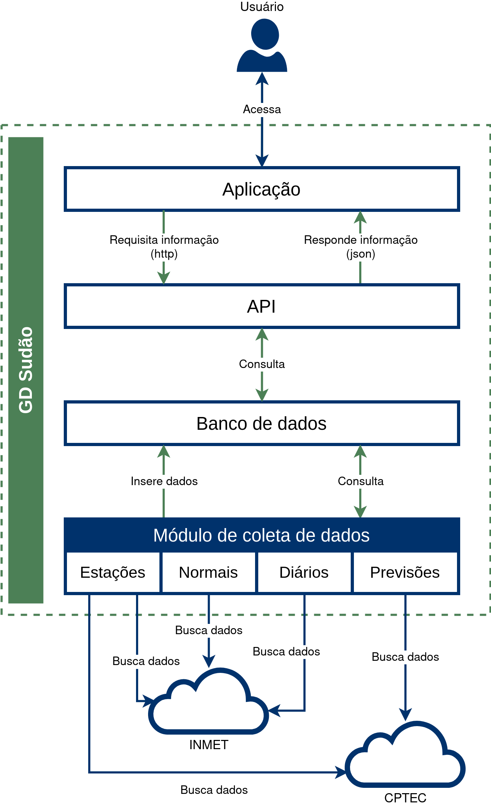

# GD Sudao
### Sobre:

GD Sudão é um Sistema de Informação de Gestão Agropacuária (FMIS) voltado ao manejo de capim-sudão, desenvolvido como projeto de mestrado de Ricardo Robaina, em uma parceria entre a Universidade Federal do Pampa e a Embrapa Pecuária Sul.


### Arquitetura




### Compilação

1. Clone o repositoório

   ```bash
   $ git clone https://github.com/rprobaina/gdsudao
   $ cd gdsudao
   ```

2. Instale as dependências

   ```bash
   $ ./dependencias/instala_dependencias.sh
   ```

3. Instalar a linguagem de programação Go

   ```bash
   $ sudo dnf install go
   ```

4. Compilar e executar (Desenvolvimento e Testes)

   ```bash
   $ go run main.go
   ```

5. Compilar para um arquivo executável (Implantação)

   ```bash
   $ go build main.go <nome_do_programa>
   ```

   

## Implantação

Os passos a seguir devem ser executados em um sistema operacional linux, preferencnialmente na distribuição Fedora 32+.

#### Instalação do banco de dados

1. Habilitar o repositório

   ```bash
   $ sudo vi /etc/yum.repos.d/mongodb-org-4.4.repo
   
   ## Adicionar o seguinte contepudo nesse arquivo: ##
   
   [mongodb-org-4.4]
   name=MongoDB Repository
   baseurl=https://repo.mongodb.org/yum/redhat/8Server/mongodb-org/4.4/x86_64/
   gpgcheck=1
   enabled=1
   gpgkey=https://www.mongodb.org/static/pgp/server-4.4.asc
   ```

2. Instalar os pacotes

   ```bash
   $sudo dnf install -y mongodb-org
   ```

3. Instalar o SGBD

   https://downloads.mongodb.com/compass/mongodb-compass-1.26.1.x86_64.rpm


#### Instalar o Módulo de coleta de dados


#### Instalar a API


#### Configurar a Crontab


